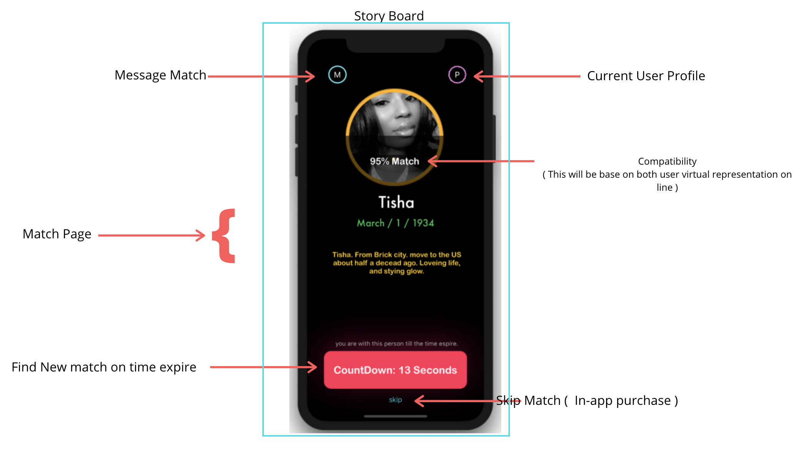
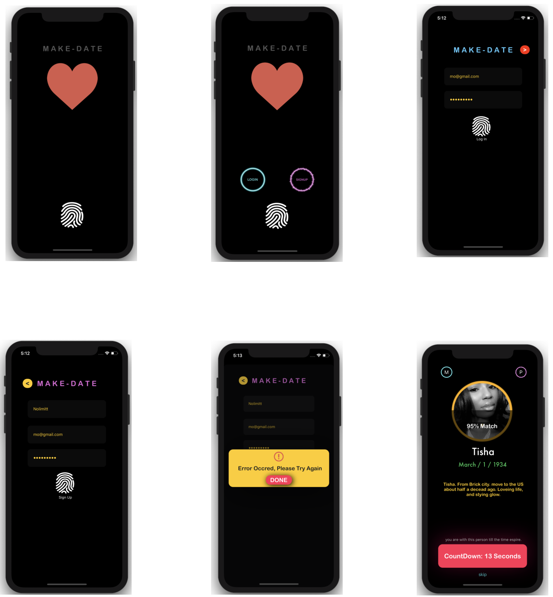

<h1 align="center">
   
  
   
  MAKE  DATE 
   
</h1>

<h4 align="center">A simple Dating app .</h4>

### Description:

* Make Date is my term two intensive project: Its  a dating app implemting CRUD. 

### UI/UX

### Technology :

* Swift 
* Cocoapod 
* Custom self-built ProgressHud
* Custom self-built Error Handling UIView Hud
* C R U D : ( FireBase Storage for images & FireBase Data Base for User profile)
* Auth : Firebase Auth

### Todo: 

* Refactor code base and write more reusable classes.

